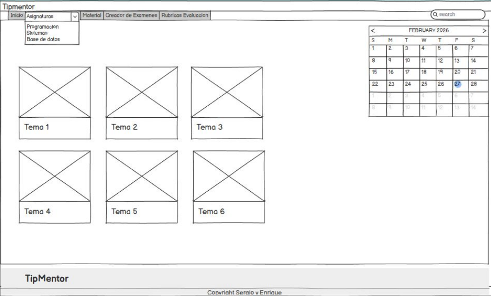

# Reto-ODS4-Sergio
---
## Diagnóstico
Algunos de los **errores** que hemos encontrado en el sistema educativo son los siguientes

- Los resultados de todo el año academico dependen plenamente de *los R.As*

- Los contenidos estan inadaptados al ambiente laboral y son dependientes de una explicacion *intuitiva*

- Algunos profesores no saben que tienen que hacer y acaban siendo mas estrictos siendo menos efectivos cara al futuro laboral

- Mal mantenimiento de las instalaciones del centro educativo

- Los examenes estan mal planteados, provocando que los alumnos acabe sacando peores notas

## Solución

## Prototipo

##Impacto sostenible
